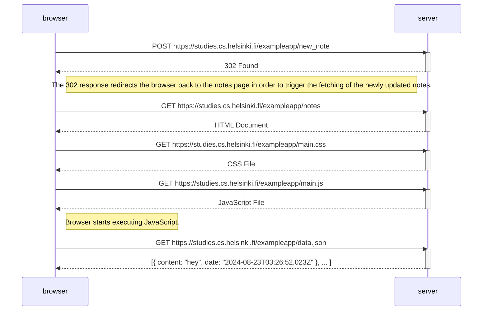

```mermaid
sequenceDiagram
    participant browser
    participant server

	browser->>server: POST https://studies.cs.helsinki.fi/exampleapp/new_note
    activate server
    server-->>browser: 302 Found
    deactivate server
	
	Note right of browser: The 302 response redirects the browser back to the notes page in order to trigger the fetching of the newly updated notes.
	
	browser->>server: GET https://studies.cs.helsinki.fi/exampleapp/notes
    activate server
    server-->>browser: HTML Document
    deactivate server
	
	browser->>server: GET https://studies.cs.helsinki.fi/exampleapp/main.css
    activate server
    server-->>browser: CSS File
    deactivate server

    browser->>server: GET https://studies.cs.helsinki.fi/exampleapp/main.js
    activate server
    server-->>browser: JavaScript File
    deactivate server
	
	Note right of browser: Browser starts executing JavaScript.
	
	browser->>server: GET https://studies.cs.helsinki.fi/exampleapp/data.json
    activate server
    server-->>browser: [{ content: "hey", date: "2024-08-23T03:26:52.023Z" }, ... ]
    deactivate server
```
